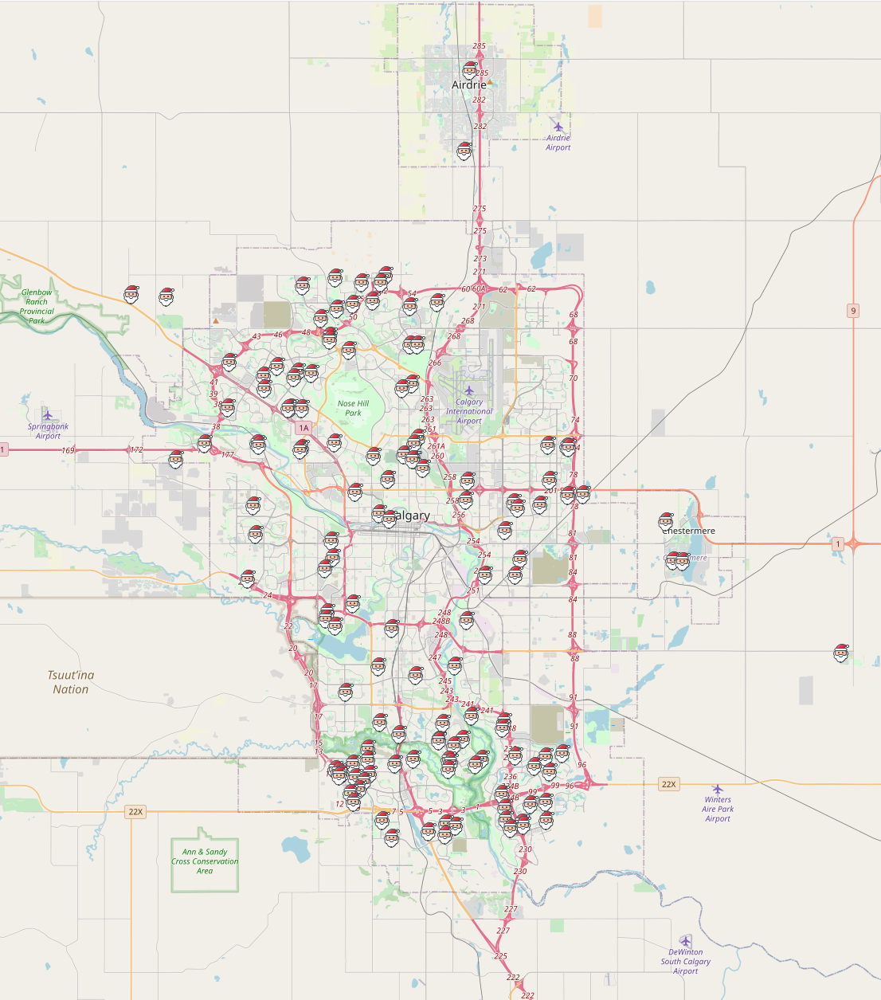

    

# lighten-up-calgary

A playground for YYC Christmas light displays

The demo can be found at https://lighten-up-calgary.herokuapp.com/

## Environment

- Python 3.9
- Windows 10

## Install

Create a virtual environment.

    python -m venv .venv
    .\.venv\Scripts\activate

Then install dependencies.

    pip install -r .\requirements.txt

> Use `pip install -r requirements-dev.txt` for development.
> It will install `pylint`, `black`, and `jupyterlab` to enable linting, auto-formatting, and notebook experience.

## Usage

**IMPORTANT:** You need a GCP API key for geocoding and MapQuest API key to get the optimized route.

Create a `.env` file to store your GCP API key and MapQuest API key.

    # .env
    # required
    MAPQUEST_KEY="xxx"
    GCP_KEY="yyy"

### Crawling address data from [Lighten UP Calgary][1] for year 2020

    python .\crawl.py 2020

Address data will be saved in `2020.json` located at the `data` folder. Addresses come with latitude/longitude and are formatted.

### Visualizing address data

    python .\display.py

Interactive html files `display.html` and `route.html` will be saved at the `output` folder.

1. Given a starting location and a list of addresses, find the best route to see all light displays (`route.html`)

   

   > Estimated time for the trip is printed in the console.

2. Simply show all the light displays (`display.html`)

   

### Demo Webapp

    python .\app.py

## Credits

- [Lighten UP Calgary][1]

- [Santa Claus Icon][2] by [Alpár-Etele Méder][3]

[1]: https://lightenupcalgary.ca/
[2]: https://www.iconfinder.com/icons/1651938/christmas_claus_santa_icon
[3]: https://www.iconfinder.com/pocike
